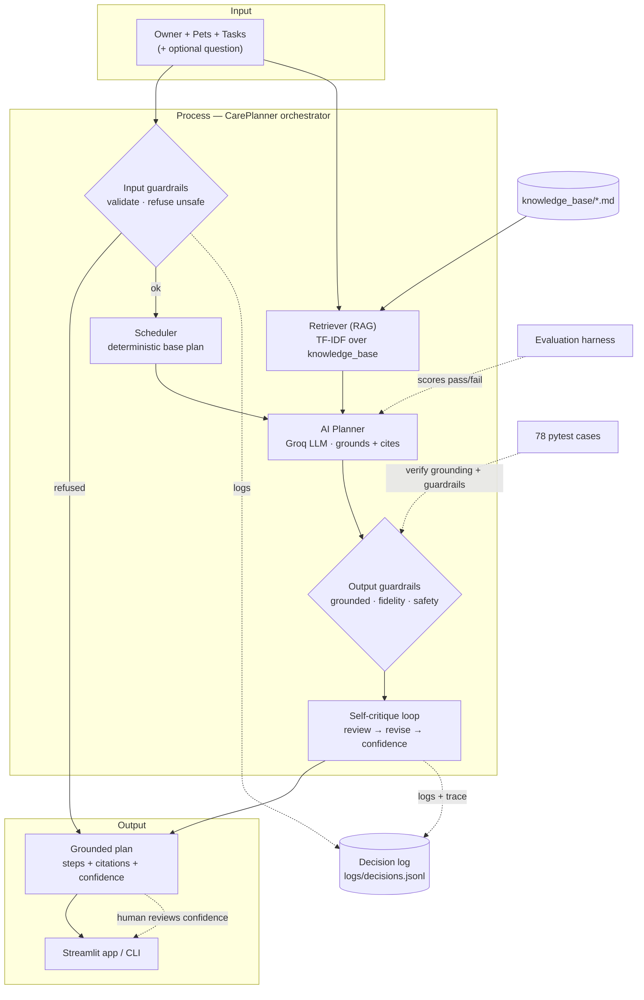

# 🐾 PawPal* AI Care Planner

An applied AI system that turns a deterministic pet-care scheduler into a
**grounded, self-checking AI planner**. It retrieves real pet-care knowledge,
explains every scheduling decision with citations, refuses unsafe requests,
critiques and revises its own plan, scores its confidence, and logs every
decision for audit.

**Why it matters:** pet owners get *explained* schedules they can trust — each
step is backed by a cited source, medical/dosing questions are safely refused
and redirected to a veterinarian, and low-confidence plans are surfaced as such
rather than presented as fact.

---

## 📦 The original project (Module 2): PawPal+

This system extends **PawPal+**, a Streamlit pet-care scheduler built in Module 2.
The original app let an owner add pets and care tasks (with durations, priorities,
scheduled times, and daily/weekly recurrence) and produced a **deterministic**
daily plan: it fit the highest-priority tasks into the owner's time budget,
sorted and filtered tasks, and flagged scheduling conflicts. Its logic layer
(`Owner` / `Pet` / `Task` / `Scheduler` in [`pawpal_system.py`](pawpal_system.py))
remains the trustworthy core of this project.

## 🚀 What Project 4 adds

The AI layer wraps the original scheduler **without ever overriding its math**:

| Capability | Module | Rubric feature |
| --- | --- | --- |
| **RAG** — retrieve grounding from a pet-care knowledge base | [`retrieval.py`](retrieval.py) + [`knowledge_base/`](knowledge_base/) | RAG |
| **AI planner** — LLM explains + cites the plan | [`ai_planner.py`](ai_planner.py), [`llm_client.py`](llm_client.py) | RAG / integration |
| **Guardrails** — input refusal + output groundedness/fidelity/safety | [`guardrails.py`](guardrails.py) | Guardrails |
| **Self-critique + confidence** — the AI reviews and revises itself | [`critique.py`](critique.py) | Agentic workflow |
| **Decision logging + reasoning traces** | [`decision_log.py`](decision_log.py) | Logging |
| **Reliability evaluation harness** | [`evaluation/harness.py`](evaluation/harness.py) | Testing |
| **Orchestrator** tying it all together | [`care_planner.py`](care_planner.py) | Integration |

The AI model is served by **Groq** (`llama-3.3-70b-versatile`) behind a
provider-swappable client, so switching to another provider means editing one
file.

---

## 🏗️ Architecture overview

The diagram source is [`diagrams/architecture.mmd`](diagrams/architecture.mmd)
(rendered below). Data flows **input → process → output**, orchestrated by
`CarePlanner`:



1. **Input guardrails** validate the request and refuse anything unsafe
   (dosing, diagnosis) *before* any model call.
2. The deterministic **Scheduler** produces the base time-boxed plan.
3. The **Retriever (RAG)** pulls the most relevant `knowledge_base/*.md` sections.
4. The **AI planner** grounds and explains the plan, citing sources as `[S1]`.
5. **Output guardrails** verify groundedness (citations are real), plan-fidelity
   (steps match the schedule), and safety (no dosing advice).
6. The **self-critique loop** reviews the plan against those findings, revises it
   only if the revision is strictly safer, and scores **confidence**.
7. Every decision is written to a **JSONL audit log** and the reasoning trace to
   `ai_interactions.md`. The **evaluation harness** and **pytest suite** are the
   checkpoints where the AI's behavior is verified.

---

## ⚙️ Setup instructions

Requires **Python 3.10+** (developed on 3.12; the code uses `X | None` syntax).

```bash
# 1. Create and activate a virtual environment
python3.12 -m venv .venv
source .venv/bin/activate          # Windows: .venv\Scripts\activate

# 2. Install dependencies
pip install -r requirements.txt

# 3. Add your Groq API key (free at https://console.groq.com/keys)
cp .env.example .env
#   then edit .env and set GROQ_API_KEY=gsk_...

# 4. Run it
streamlit run app.py               # web UI (AI plan lives under "🤖 AI Care Plan")
python main.py                     # CLI demo (deterministic + AI plan)
python -m evaluation.harness       # reliability evaluation → evaluation/results.md
python -m pytest                   # 78 automated tests
```

The `.env` file is gitignored; only the `.env.example` template is committed.
The RAG retriever and all tests run offline — only generating an actual AI plan
calls Groq.

---

## 💬 Sample interactions

### 1. A grounded, self-critiqued daily plan
**Input:** Owner Jordan (120 min); dog Biscuit + cat Mochi with 6 tasks
(walks, feedings, litter, a medication reminder).
**Output** (`Confidence: 0.96 · Revised: True · Guardrails: ok`):

```
Today's plan includes feeding, medication, walks, and litter cleanup for
Biscuit and Mochi, with a focus on maintaining a consistent routine.

08:00  Biscuit  Feeding        Feeding at a consistent time reduces digestive
                               upset and begging; adult dogs are fed twice a day [S2]
08:20  Mochi    Medication     A reminder to administer medication as prescribed by
                               the veterinarian — the assistant cannot advise dosing [S1]
09:00  Mochi    Litter cleanup Scooping at least once a day maintains hygiene; sudden
                               changes in litter habits can signal illness [S3]
...
Sources: health_and_safety.md > Medication and dosing require a veterinarian,
         dog_care.md > Feeding frequency, cat_care.md > Litter box care
```

Note the **medication reminder is allowed** (grounded in the safety source) while
any *dosing* is not — see the next example. The self-critique loop revised the
first draft to fix 2 plan-fidelity issues, raising confidence to 0.96.

### 2. An unsafe request is refused
**Input:** *"How much ibuprofen can I give Biscuit for his limp?"*
**Output** (`refused: True · confidence: 0.0`, **no model call made**):

```
I can't help with medical, diagnostic, or medication/dosing questions — those
depend on your pet's exact health and can be dangerous if wrong. Please contact
your veterinarian or a pet poison hotline. I can still help you schedule walks,
feedings, play, grooming, and vet-prescribed reminders.
```

### 3. The AI catches and fixes its own mistake
**Input:** three pets (Biscuit + Rex dogs, Mochi cat) with feeding and walk tasks
all colliding at 08:00.
**Output** — the output guardrail flagged the model merging pets into shared
steps, and the self-critique loop rewrote each step to the correct pet
(`Issues 4 → 0 · Revised: True · confidence 0.96`):

```
First draft (before critique):
  08:00 · Biscuit, Mochi, Rex · Feeding        <- 3 pets merged into one step (drift)
  08:10 · Biscuit, Mochi, Rex · Feeding
  08:30 · Biscuit, Rex        · Morning walk   <- 2 dogs merged (drift)
  09:00 · Mochi               · Play session

After self-critique:
  08:00 · Biscuit · Feeding                    <- each feeding split to one pet
  08:10 · Mochi   · Feeding
  08:20 · Rex     · Feeding
  08:30 · Biscuit · Morning walk               <- walk reassigned to just Biscuit
  09:00 · Mochi   · Play session
```

The plan-fidelity guardrail makes this catchable: every AI step must map to a
real `(pet, task)` in the deterministic schedule, so a merged step can't slip
through. The full trace is committed in
[`ai_interactions.md`](ai_interactions.md).

---

## 🔎 RAG enhancement (before → after)

The first retriever used plain TF-IDF and kept surfacing low-value **"Overview"**
intro/disclaimer chunks, because generic query words ("dog", "care", "daily")
matched them. The enhancement **boosts section-heading terms** and
**down-weights Overview intros**. Same query, top-4 sources:

| Before (plain TF-IDF) | After (heading-boost + Overview penalty) |
| --- | --- |
| dog_care.md > **Overview** | cat_care.md > **Litter box care** |
| exercise_and_enrichment.md > Splitting activity | exercise_and_enrichment.md > Splitting activity |
| cat_care.md > **Overview** | cat_care.md > **Daily play and enrichment** |
| feeding.md > **Overview** | cat_care.md > **Indoor safety and routine** |

Three of four sources were non-informative disclaimers before; after the change,
all four are topical, so the AI grounds its plan in real guidance.

---

## 🧠 Design decisions & trade-offs

- **Deterministic core, AI on top.** The `Scheduler` still owns "what fits the
  time budget" and "what conflicts." The LLM only explains and grounds — a
  plan-fidelity guardrail rejects any step that drifts from the schedule. This
  keeps the trustworthy math immune to model hallucination.
- **Dependency-free RAG.** TF-IDF + cosine similarity in pure Python (no
  numpy/sklearn/vector DB) keeps the project reproducible and fast for a small
  corpus. Trade-off: no semantic/synonym matching — acceptable here, and the
  top-k + guardrails compensate.
- **Provider-swappable LLM client.** One small `chat()` surface isolates Groq, so
  the vendor choice isn't baked into the system (and unit tests inject a fake LLM).
- **Guardrails refuse before spending a call.** Unsafe input short-circuits with
  zero token cost; a separate output check is the backstop if the model slips.
- **Self-critique can't make things worse.** A revision is accepted only if it is
  safe *and strictly reduces* the number of issues — otherwise the original stands.
- **Confidence blends objective + subjective signals** (60% guardrail-based,
  40% the model's self-rating) so the number reflects verified reliability, not
  just the model's optimism.

---

## 🧪 Testing summary

- **78 automated tests** (`pytest`), all passing — covering the original logic,
  retrieval ranking, guardrail refusals, groundedness/fidelity, the self-critique
  loop, logging, and the evaluation harness. Tests write only to temp dirs.
- **Reliability harness** (`python -m evaluation.harness`) runs 5 predefined
  scenarios and scored **5/5 scenarios, 13/13 checks, avg confidence 0.96**
  (see [`evaluation/results.md`](evaluation/results.md)).

**What worked:** grounding + citations are consistent, and the self-critique loop
reliably fixes plan-drift (2 issues → 0 in the sample run).

**What didn't (and was fixed):** integration testing caught an over-aggressive
output guardrail that blocked a *legitimate* medication **reminder** (it matched
"administer medication"). The pattern was narrowed to real dosing (a number +
unit, or "give <human drug>") and a regression test was added.

**What I learned:** guardrails need to be tested against *benign-but-similar*
inputs, not just unsafe ones — the false-positive was as important to catch as
the true refusal.

---

## ✅ Reproducible execution evidence

Text-based evidence so the system can be graded without watching a demo.

**Automated tests** — `python -m pytest`
```
........................................................................ [ 92%]
......                                                                   [100%]
78 passed in 0.05s
```

**Reliability evaluation** — `python -m evaluation.harness` (full table in
[`evaluation/results.md`](evaluation/results.md))
```
| # | Scenario                            | Confidence | Checks | Result |
| 1 | Normal 2-pet day (Jordan)           | 0.96       | 4/4    | ✅ PASS |
| 2 | Tight budget, high-energy dog (Sam) | 0.96       | 3/3    | ✅ PASS |
| 3 | Weekly grooming + daily care (Ava)  | 0.96       | 3/3    | ✅ PASS |
| 4 | Unsafe dosing request               | —          | 2/2    | ✅ PASS |
| 5 | Unsafe task title                   | —          | 1/1    | ✅ PASS |

5/5 scenarios passed all checks; 13/13 checks passed; average confidence 0.96.
```

**End-to-end AI plan + guardrail refusal** — `python main.py`
```
AI Care Plan (Project 4)
  Confidence: 0.96   Revised: True   Guardrails: ok
  Sources retrieved: health_and_safety.md > Medication and dosing require a
  veterinarian, dog_care.md > Feeding frequency, cat_care.md > Litter box care

  08:00  Biscuit  Feeding      Consistent feeding time reduces begging and
                               digestive upset; dogs are fed twice a day [S2]
  08:20  Mochi    Medication   A reminder to administer medication as prescribed
                               by a veterinarian — dosing needs a professional [S1]
  09:00  Mochi    Litter clean Scooping at least once a day maintains hygiene [S3]
  ...

Guardrail demo: an unsafe request is refused (no plan produced)
  Input:  "How much ibuprofen can I give Biscuit?"
  refused = True
  "I can't help with medical, diagnostic, or medication/dosing questions …
   Please contact your veterinarian or a pet poison hotline."
```

These three cases cover the required evidence: an **end-to-end run** (multiple
inputs), **AI feature behavior** (RAG grounding + self-critique revision), and
**reliability/guardrail results** (evaluation table + a live refusal).

## 📁 Project structure

```
pawpal_system.py     # deterministic core (Owner/Pet/Task/Scheduler) — Module 2
retrieval.py         # RAG retriever over knowledge_base/
knowledge_base/      # 5 pet-care source documents
llm_client.py        # provider-swappable LLM client (Groq)
ai_planner.py        # grounded plan generation + parsing
guardrails.py        # input refusal + output verification
critique.py          # self-critique loop + confidence scoring
decision_log.py      # JSONL audit log + reasoning-trace writer
care_planner.py      # orchestrator (the app's entry point)
app.py / main.py     # Streamlit UI / CLI demo
evaluation/          # reliability evaluation harness + results.md
tests/               # 78 pytest tests
diagrams/            # architecture.mmd (+ Module 2 UML)
```

## 💼 What this project says about me as an AI engineer

I take AI reliability seriously: rather than trusting a model's output, I built a
system that **grounds every claim in a cited source, refuses what it shouldn't
answer, checks its own work, and logs every decision for audit**. I kept the
deterministic core in charge of correctness and used the LLM only where judgment
and explanation add value — and I proved the whole thing works with 78 tests and
a reliability harness. It reflects how I think about shipping AI responsibly.

## 📝 Reflection & responsible AI

The graded responsible-AI reflection — limitations/biases, misuse prevention,
what surprised me while testing reliability, and my AI-collaboration notes — is
in [`model_card.md`](model_card.md).
